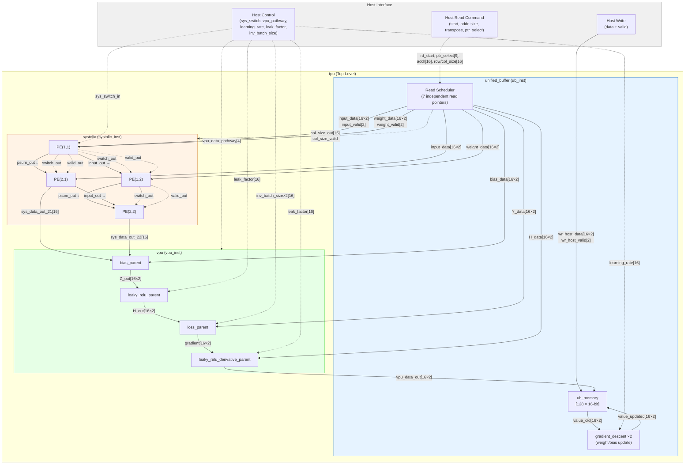

# TitanTPU 顶层架构分析

## 1. Top-Level 模块定位

Top-level 模块为 `tpu`，位于：

```
_vendor/tiny-tpu/src/tpu.sv
```

该模块是整个 TPU 加速器的顶层，参数化脉动阵列宽度 `SYSTOLIC_ARRAY_WIDTH=2`，内部无输出端口——所有计算结果通过 VPU 回写至 Unified Buffer，由 Host 侧通过写端口加载/读取数据。

---

## 2. Top 模块 I/O 接口表

| 信号名 | 位宽 | 方向 | 所属协议/接口 | 功能描述 |
|---|---|---|---|---|
| `clk` | 1 | input | Global | 系统时钟 |
| `rst` | 1 | input | Global | 异步高有效复位 |
| `ub_wr_host_data_in[0:1]` | 16×2 | input | Custom Host Write | Host 向 Unified Buffer 写入的数据（每列一路） |
| `ub_wr_host_valid_in[0:1]` | 1×2 | input | Custom Host Write | Host 写入有效指示 |
| `ub_rd_start_in` | 1 | input | Custom Read Cmd | UB 读命令启动脉冲 |
| `ub_rd_transpose` | 1 | input | Custom Read Cmd | 读取时是否转置矩阵 |
| `ub_ptr_select` | 9 | input | Custom Read Cmd | UB 内部指针选择（0=input, 1=weight, 2=bias, 3=Y, 4=H, 5=grad_bias, 6=grad_weight） |
| `ub_rd_addr_in` | 16 | input | Custom Read Cmd | UB 读起始地址 |
| `ub_rd_row_size` | 16 | input | Custom Read Cmd | 待读矩阵的行数 |
| `ub_rd_col_size` | 16 | input | Custom Read Cmd | 待读矩阵的列数 |
| `learning_rate_in` | 16 | input | Custom Control | 梯度下降学习率（Q8.8 定点数） |
| `vpu_data_pathway` | 4 | input | Custom Control | VPU 数据通路选择（bit3=bias, bit2=LeakyReLU, bit1=loss, bit0=LeakyReLU'） |
| `sys_switch_in` | 1 | input | Custom Control | 脉动阵列权重 shadow→active buffer 切换信号 |
| `vpu_leak_factor_in` | 16 | input | Custom Control | LeakyReLU 泄漏因子 |
| `inv_batch_size_times_two_in` | 16 | input | Custom Control | 1/(2×batch_size)，用于 loss 梯度计算 |

> **注意**：`tpu` 模块当前没有显式 output 端口。计算结果通过 VPU→UB 内部回写闭环完成，Host 通过 `ub_wr_host_*` 端口加载数据、通过同一 UB 存储读回结果。该接口不属于任何标准总线协议（AXI/APB/SRAM-IF），是纯自定义的 command-based 接口。

---

## 3. 核心子模块层次

### 第一层（tpu 直接例化）

| 实例名 | 模块名 | 所在文件 | 功能 |
|---|---|---|---|
| `ub_inst` | `unified_buffer` | `_vendor/tiny-tpu/src/unified_buffer.sv` | 统一缓冲区：存储所有矩阵数据，调度读写，内含梯度下降单元 |
| `systolic_inst` | `systolic` | `_vendor/tiny-tpu/src/systolic.sv` | 2×2 脉动阵列：执行矩阵乘法（含 4 个 PE） |
| `vpu_inst` | `vpu` | `_vendor/tiny-tpu/src/vpu.sv` | 向量处理单元：bias 加法、LeakyReLU、loss 导数、激活导数 |

### 第二层（子模块内部例化）

| 父模块 | 实例名 | 模块名 | 功能 |
|---|---|---|---|
| `unified_buffer` | `gradient_descent_gen[0:1].gradient_descent_inst` | `gradient_descent` | 权重/偏置梯度更新（generate ×2） |
| `systolic` | `pe11, pe12, pe21, pe22` | `pe` | 处理单元（MAC + 权重双缓冲） |
| `vpu` | `bias_parent_inst` | `bias_parent` | 偏置加法 |
| `vpu` | `leaky_relu_parent_inst` | `leaky_relu_parent` | LeakyReLU 激活函数 |
| `vpu` | `loss_parent_inst` | `loss_parent` | 损失导数计算 |
| `vpu` | `leaky_relu_derivative_parent_inst` | `leaky_relu_derivative_parent` | 激活函数导数 |

### 外部辅助模块（未集成到 tpu 内部）

| 模块名 | 所在文件 | 功能 |
|---|---|---|
| `control_unit` | `_vendor/tiny-tpu/src/control_unit.sv` | 88-bit 指令解码器，将指令字段映射为 tpu 各输入控制信号 |

---

## 4. 顶层微架构框图（Mermaid）

> 实线 = 数据流（Datapath），虚线 = 控制信号流（Control Path）



---

## 5. 核心数据环路

```
Host → UB → Systolic Array → VPU → UB (writeback)
                                      ↓
                              Gradient Descent → UB (weight update)
```

这是一个典型的 training-capable TPU 微架构：
- **前向传播**：通过 Systolic→VPU 完成矩阵乘 + 激活（pathway=`1100`）
- **过渡阶段**：Systolic→Bias→ReLU→Loss→ReLU'（pathway=`1111`）
- **反向传播**：通过 VPU 内的 loss/derivative 模块计算梯度（pathway=`0001`）
- **参数更新**：由 UB 内嵌的 gradient_descent 单元原地更新权重和偏置
